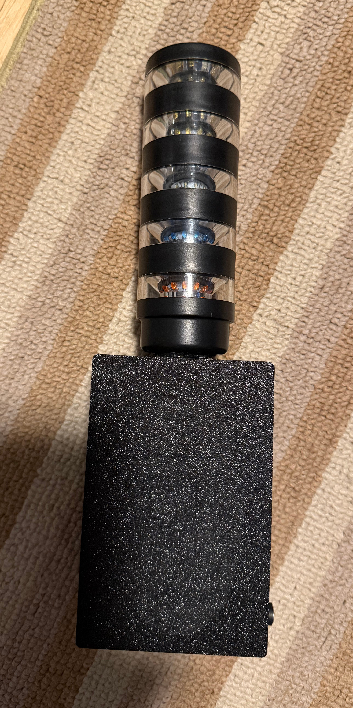
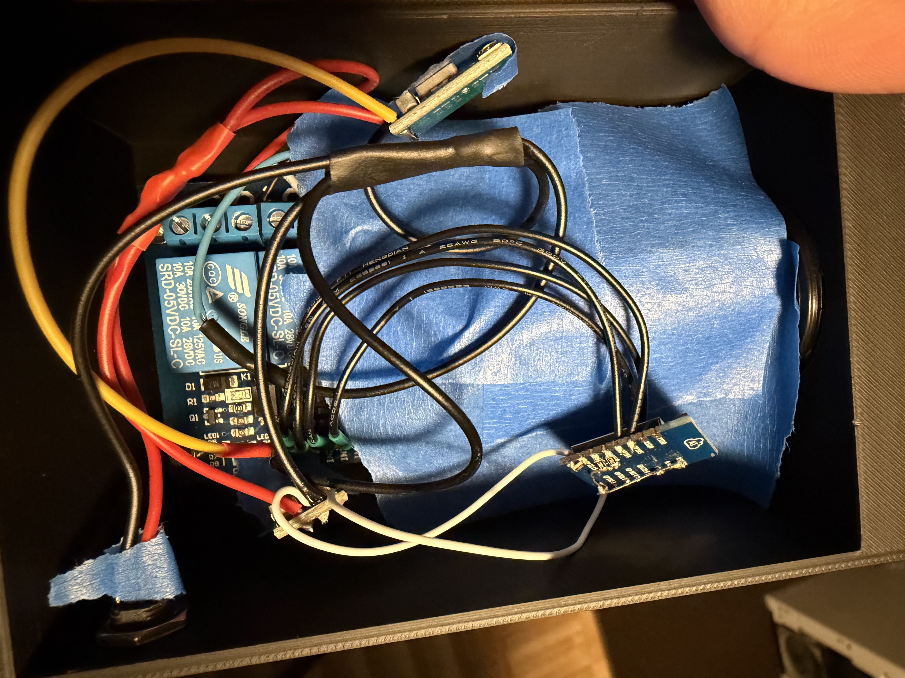
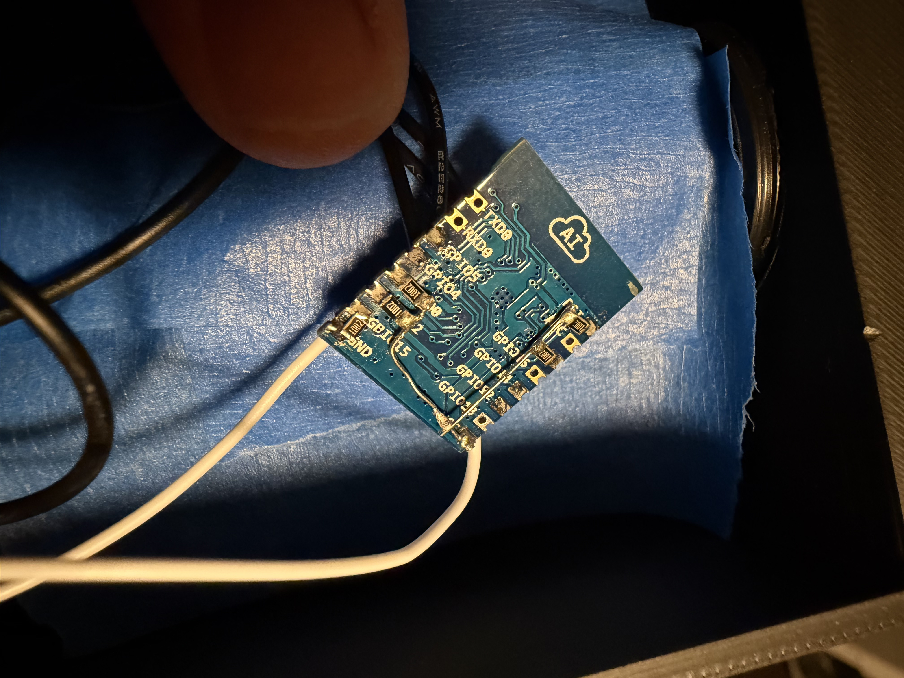

# P1150, Banner TL50BL Beacon Light Box

This project started because I got a Banner TL50BL beacon tower light (tl50blrbwy2y2pq to be exact) at a flea market.



# Build
This was a one-time build, so the details may be murky (especially on which esp8266 IO goes to which relay), but alas should be enough for replication.

I also added masking tape inside so that the flying buck converters won't accidentally short something out.



## Enclosure
The enclosure is designed to be 3D printed, with the M30 thread built into the model. The STL can be found in the [`release`](release) folder.

## Electronics
The electronics inside is designed around parts I already had, which includes:
- The light tower itself, with it's M12 screw connector
- An [inland 4 channel relay](https://www.microcenter.com/product/659888/inland-4-channel-5v-relay-module-for-arduino) I got at Microcenter
- An ESP-12E module I had from ages ago. I got them from TaydaElectronics, but now they sell [an upgraded version](https://www.taydaelectronics.com/esp8266-esp-12-f.html) it seems
- Two [small buck converter modules from Aliexpress](https://www.aliexpress.us/item/3256806906184086.html)
- A generic 2.1x5.2mm DC barrel jack
- An external 12V AC/DC power supply

First the DC barrel jack, which will be supplied with 12v, is connected to both the buck converters. One buck converter is set (through the jumpers in the back) for a 5v output, the other for 3.3v. The 5v output goes to the VCC/GND pins of the relay module's IO header. Both buck converter's and the input's GND are connected together, like a happy family!

The ESP-12E is wired so there is a 1k pull-up for RST, EN, GPIO0, and GPIO2, and a 1k pull-down to GND for GPIO15, which are needed for operation. The VCC and GND are connected to the output of the 3.3v buck converter.
The relay IO pins are connected to some IOs declared in the esphome setup (GPIO4, GPIO12, GPIO14, and GPIO5). I wasn't too peculiar with the IO setup and which relay it went to, so you can either copy the same setup as the esphome config file, or change the config to suite your needs.



On the M12 connector, the blue wire is connected to 12v, and the colored wire are connected to each relay's NO (normally open) pin.

The relay is wired so that all the COM pin (the middle of the 3 position terminal block for each relay) are tied together to GND.

## ESPHome Flashing

To flash the ESP8266, ideally before wiring it up (it was a pain with it), I used a generic ESP programmer with a springy header to program these modules, [for example this](https://www.aliexpress.us/item/3256805953510925.html)

You must have ESPHome installed and ready to go, then flash the config `led_light_tower.yaml`

You will need to create a `secrets.yaml` in this directory for the WIFI stuff. An example of such file with the required keys is shown as follows:

```yaml
wifi_ssid: "ENTER-SSID"
wifi_pass: "ENTER-PASS"
wifi_fb_pass: "ENTER-PASS"
```

# License
This project is licensed under [GPLv3](LICENSE.md)
